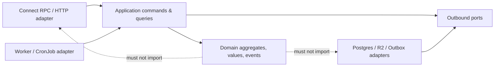

# Fish Website 重构蓝图（DDD、整洁架构与 K3s）

**状态：** 提案，尚未实施  
**审查日期：** 2026-08-06  
**范围：** 后端、API 契约与代码生成、前端边界、数据模型、CI/CD、K3s、对象存储迁移。本文不改变线上资源。

## 1. 结论与架构决策

当前项目不是“再整理几个目录”即可达到可持续维护的状态。它是一个功能可用的单体，但领域模型、事务边界、数据迁移、构建复现性和运行时安全模型混在一起；若继续以当前方式叠加功能，媒体、文章和权限相关的数据一致性风险会累积。

建议采用 **模块化单体（modular monolith）**：一个 `website-api` 部署单元、一个独立的异步 `media-worker`，共享 PostgreSQL 但按 schema/表和代码边界隔离。不要在本阶段拆成微服务。单节点 K3s 无法从微服务获得可用性收益，反而会增加网络、部署和分布式事务复杂度。模块化单体能先落实 DDD、六边形架构、契约治理、可替换基础设施和独立演进；以后若有真实的吞吐或团队边界，再从模块中提取服务。

保留 Go + Connect RPC + PostgreSQL + React/Vite + Argo CD/Kustomize 的总体技术方向；替换当前 PostgreSQL 的裸 StatefulSet 使用方式，移除 MinIO，接入 Cloudflare R2。保留现有“推送 `main` → 构建不可变镜像 → 提交 GitOps tag → Argo CD 同步”的主干，但把它收紧为可验证、可回滚、可审计的发布流程。

## 2. 本次审查证据与风险分级

### P0：先恢复部署与数据安全，禁止与大重构混做

| 问题 | 证据 | 影响 | 处理原则 |
| --- | --- | --- | --- |
| 生产应用已降级 | 集群中 `fish-website` Argo Application 为 `Synced/Degraded`；backend、frontend、postgres 均非 Ready | 站点不能正常提供服务；`Synced` 不能被当作健康 | 另立 P0 修复 PR，先让当前版本稳定运行，再开始结构迁移 |
| PostgreSQL 无法启动 | `postgres:17.4-alpine` 日志显示对 `/var/run/postgresql` 和数据目录 `chmod/chown` 均无权限；工作负载复用了受限 ServiceAccount/安全策略 | 数据库不可用；当前迁移没有验证机会 | 用镜像支持的 UID/GID 和 `fsGroup` 或经验证的数据库 operator 部署；先在全新 PVC 演练 |
| 前端与只读根文件系统不兼容 | Nginx 因 `/var/cache/nginx/client_temp` 是只读文件系统退出；现有 volume 未覆盖 `client_temp` 的实际路径 | 前端 CrashLoopBackOff | 使用非 root Nginx 镜像/自定义临时目录并逐项挂载 `emptyDir`，以 `nginx -t` 和运行时探针验收 |
| 后端镜像安全上下文与镜像不一致 | 集群事件：`runAsNonRoot`，但 backend 镜像将以 root 运行；`Dockerfile` 的最终镜像无 `USER` | 后端无法创建容器 | 构建为非 root 的 distroless 或固定 Alpine 运行镜像，并在 CI 用 Pod Security/容器扫描验证 |
| 镜像引用存在悬挂 tag | 集群事件显示 `sha-9216…` 不存在；当前一些副本仍 ImagePullBackOff | 回滚和 GitOps 不可靠 | 发布前验证 registry manifest，GitOps 使用 **digest** 而非仅 tag；每次同步后等待健康状态 |
| 持久卷会随 PVC 删除 | 当前默认 `local-path` StorageClass 的 `reclaimPolicy=Delete`；PostgreSQL、MinIO、Registry 都是单节点本地卷 | 误删命名空间/PVC 可能直接丢数据；单节点失效即不可用 | PostgreSQL 改为 operator 管理 + `Retain`/可恢复备份；R2 负责异地对象与备份，定期做恢复演练 |

上述是本次真实集群只读检查结果，不是推测。修复 P0 时应保持数据卷不删除、Argo 自动同步不暂停，只通过 Git 中的声明式变更修复。

### P1：架构与安全缺陷

| 位置 | 发现 | 风险与重构动作 |
| --- | --- | --- |
| `cmd/server/main.go` | 应用启动时执行整份 `schema.sql`；`cmd/server/schema.sql` 与 `internal/repository/schema.sql` 是重复副本 | 扩容/重启时有 DDL 竞争，无法审计、回滚和版本化。改为 `goose` 或 `atlas` 迁移，由 Argo PreSync Job 单实例执行 |
| `pkg/config/config.go`、`config.yaml` | 数据库、MinIO 和 JWT 默认凭据/示例秘密直接在可执行配置路径中 | 默认值可能误入生产且密钥轮转不清晰。配置只保留非敏感默认值；秘密只来自受管理 Secret |
| `internal/usecase/auth.go` | `username` 未参与身份校验；口令明文比较；JWT 只有固定 `sub=admin`；无失败限流、撤销、会话追踪 | 暴力破解、凭据治理、审计均不合格。引入 Owner identity、Argon2id 密码哈希、短会话/刷新令牌或安全 cookie、登录限流与审计 |
| `cmd/server/main.go` | CORS 为 `*` 且允许所有头；反射服务对外暴露 | 任何网站可调用可读 API，认证面与接口发现面扩大。按环境配置允许源，反射只在 development/受保护诊断端口启用 |
| `internal/repository/minio.go` | 启动期间创建 bucket 并设置全桶 public-read；浏览器可见 URL 指向内部 `minio:9000`；上传签名未实际绑定所构造的 `Content-Type` | 控制面与运行时耦合；对象地址不可迁移；上传约束不足。将 bucket 配置移至 IaC，数据库仅存 object key，读路径采用 CDN 自定义域名，上传采用受约束的 R2 presigned PUT |
| `internal/usecase/album.go` | 构造函数启动无取消机制的 goroutine，每日清理在 API 进程中执行 | 多副本时会重复执行；重启后时间语义和失败重试不可控。替换为 CronJob/worker，并使用可重试的任务与幂等删除 |
| `internal/usecase/*` | 写入实体与调整 `image_references` 分散在不同调用中，许多步骤不在同一事务；对象删除跨 DB/对象存储 | 部分失败会造成引用计数、数据库与对象存储不一致。以 Asset ID 建立关系表、事务内写 outbox，worker 最终执行对象操作 |
| `internal/repository/postgres.go` | 单一 1,043 行适配器实现全部 repository；游标按 `created_at DESC` 排序却以 `id < pageToken` 过滤 | 边界不清晰且分页漏数/重复的概率高。每模块独立查询适配器，使用 `(created_at,id)` 不透明 cursor |
| `internal/delivery/handler.go` | 684 行 Handler 承载所有 RPC、错误映射、DTO 转换与权限策略 | 传输层不可维护，新增接口会扩大冲突面。每个 bounded context 一个 Connect handler 与显式 policy |
| `internal/domain/entity.go` | 所有模型是贫血 struct；`Settings.CustomLinks` 是 JSON 字符串；图片引用按 URL 而非稳定 ID | 领域不变量无法表达，URL 改变会破坏引用。改为值对象、枚举、`AssetID` 外键和显式 `SocialLink` |

### P2：工程治理与前端边界

| 位置 | 发现 | 动作 |
| --- | --- | --- |
| `proto/home/v1/homepage.proto` | 单一 420 行文件包含五个服务；`UploadImageRequestRequest` 重复命名；大量 RPC 共用 `google.protobuf.Empty` | 拆分按上下文的 proto；请求/响应一对一命名；引入 HTTP 注解仅在明确需要 REST 时使用 |
| `buf.gen.yaml` | 绝对路径指向旧机器 `/home/fish/.nvm/.../node/v24.11.0` | 本机 `buf generate` 已失败，生成不可复现。改用 Buf managed plugins 或锁定 `tools.go`/npm devDependency |
| `gen/web` 与 `frontend/src/gen` | 同一 TS 生成物有两份 | 只有一个生成源目录；前端通过 workspace package 导入，禁止手工修改生成文件 |
| `frontend/src/lib/connect.ts` | `// @ts-nocheck`、522 行手写包装层和大量 `any` | 破坏 Proto 的类型收益。将 transport、auth interceptor 和按上下文的 query client 拆开，打开 strict TypeScript |
| 前端页面 | `BlogPage.tsx`、`AlbumsPage.tsx` 各 1,087 行 | 用 feature slice 拆分页面、表单、命令、查询和组件；不要让页面维护后端 DTO 兼容层 |
| 测试/质量门禁 | `go test ./...` 通过但所有包均无测试；前端依赖未安装，lint/build 无法执行；`buf lint` 已报告多条违规 | 先建立可复现安装与最小测试基线，再允许重构落地 |
| 构建镜像 | Go 构建使用 `go mod tidy`，前端使用 `npm install`，基础镜像使用浮动 `alpine:latest` | 构建可能修改依赖且不可复现。改为 `go mod download`、`npm ci`、锁定基础镜像 digest；加入 SBOM、漏洞扫描和签名 |
| 文档与文件 | 根 README 只有标题，前端 README 仍是 Vite 模板，根目录有 `test.*`、`usecase.log`、`docker-compose.yml.bak` | 清理实验残留，文档成为架构、开发、发布和恢复的唯一入口 |

## 3. 目标领域划分

### 3.1 Bounded Context

| 上下文 | 聚合根 / 值对象 | 负责的命令 | 明确不负责 |
| --- | --- | --- | --- |
| `identity` | `OwnerAccount`、`Credential`、`Session`、`Role` | 登录、登出、刷新、令牌撤销、访问策略 | 文章和媒体所有权细节 |
| `publishing` | `Article`、`TimelinePost`、`Folder`、`Tag`、`PublicationState`、`AssetAttachment` | 起草、发布、修改、归档、分类、挂载媒体 | 上传、缩略图、对象物理删除 |
| `media` | `Album`、`MediaAsset`、`UploadGrant`、`AssetLifecycle`、`ObjectKey` | 创建相册、申请上传、确认、删除请求、处理衍生图 | 文章正文和站点资料 |
| `site` | `SiteProfile`、`Theme`、`SocialLink`、`SiteAsset` | 更新个人资料、主题和社交链接 | 通用身份认证与对象存储 |
| `operations`（支撑域） | `OutboxEvent`、`Job`、`AuditRecord`、`IdempotencyKey` | 可靠派发、异步任务、审计、清理 | 业务展示模型 |

保留“短动态”和“长文章”两个聚合：二者读模型相似，但发布状态、正文长度、目录规则和前端体验不同。不要用一个泛化的 `Content` 聚合把它们重新混在一起。

### 3.2 关键模型重建

1. `Image.URL`、`ThumbnailURL` 从写模型移除。`MediaAsset` 保存不可变的 `asset_id`、`object_key`、MIME、大小、hash、状态和衍生资源；外部 URL 仅由查询/Delivery 层按访问策略投影。
2. `posts.image_urls` 改为 `post_assets(post_id, asset_id, position)`；文章正文内媒体以受解析的 `asset://<id>` 或独立 `article_assets` 关系表示。禁止再按 URL 统计引用。
3. `image_references` 不再作为可被多个 use case 手工增减的事实来源。它改为由关系表计算的查询投影；如需性能缓存，则由 outbox consumer 维护，可随时重建。
4. `MediaAsset` 状态固定为 `pending_upload → uploaded → processing → available → deletion_requested → deleted/failed`。每次状态迁移验证操作者、过期时间、对象 HEAD 元数据与 MIME/大小限制。
5. `Folder` 使用真实的 nullable parent；根目录是查询概念，不使用业务魔法 ID `root`。移动文件夹时在应用服务中拒绝自引用与祖先循环。
6. `ArticleStatus` 是领域枚举而非 string；发布必须记录 `published_at`，草稿默认不对匿名读者可见。
7. `SiteProfile` 取代 `settings` 单例杂物表；`SocialLinks` 采用结构化 JSONB 或独立表并受 URL allowlist/验证保护，绝不保存“JSON 字符串”。
8. “发布博客时同步时间线”必须成为 `PublishArticle` 明确业务规则或异步领域事件，不能由前端发两个独立请求来碰运气。

### 3.3 一致性边界

* 单聚合内的数据库写入必须在一个 application transaction 中完成。
* 跨上下文只传递 ID 和版本化事件，不直接导入对方的 repository。
* 需要对象存储副作用时，在同一 DB transaction 写 `outbox_events`；worker 采用 at-least-once 消费和幂等 object key。
* 删除先标记 `deletion_requested`，经过可配置保留期才由 worker 删除 R2 对象，并写审计记录。这样回收站不会依赖 API 实例中的 goroutine。

## 4. 目标代码库、包和文件命名

建议继续使用一个 Git 仓库、一个 Go module、一个 npm workspace；不引入多 module 的版本地狱。重构完成后的布局：

```text
.
├── apps/
│   └── web/                         # React 应用（原 frontend）
│       ├── src/features/<feature>/  # feature-first，不跨 feature 直接引用 internals
│       ├── src/shared/{api,ui,lib}/
│       └── src/generated/           # Buf 生成，gitignore，不可手改
├── services/
│   ├── website-api/
│   │   ├── cmd/server/main.go        # 只做 composition root
│   │   └── internal/
│   │       ├── bootstrap/            # DI、HTTP server、生命周期
│   │       ├── platform/             # config, db, observability, tx, authn
│   │       └── <context>/
│   │           ├── domain/           # aggregate, entity, value_object, event, errors
│   │           ├── application/      # command, query, service, port, dto
│   │           ├── infrastructure/   # postgres, r2, outbox adapter
│   │           └── transport/connect/# RPC handler + mapper，仅依赖 application
│   └── media-worker/
│       ├── cmd/worker/main.go
│       └── internal/                 # outbox、缩略图、R2 删除任务
├── api/
│   ├── proto/fish/website/<context>/v1/*.proto
│   ├── buf.yaml
│   └── buf.gen.yaml
├── gen/
│   └── go/                           # Go 生成物，唯一来源
├── db/
│   ├── migrations/                   # 000001_init.up.sql 等，仅追加
│   ├── queries/<context>/            # 若采用 sqlc
│   └── seeds/                        # 仅开发环境
├── deploy/
│   ├── clusters/tc-seoul/            # cluster bootstrap / platform addons
│   ├── apps/fish-website/base/
│   └── apps/fish-website/overlays/{dev,prod}/
├── scripts/                           # 可审计、无秘密输出的运维脚本
├── docs/{adr,architecture,runbooks}/
├── package.json                       # npm workspace root
├── go.mod
└── tools.go                           # Go 生成器/静态分析器版本锚点
```

### 命名规则

* 目录与 Go package 使用全小写单词：`publishing`、`media`；不使用 `common`、`utils`、`manager`、`helper`、`repository` 作为跨域垃圾桶。
* Go 文件使用 `snake_case.go`，按概念命名：`article.go`、`publish_article.go`、`article_repository.go`、`postgres_article_repository.go`。测试同名 `*_test.go`。
* 一个聚合根/值对象一个核心文件；应用命令与查询一个用例一个文件。允许为 cohesive 的 mapper/validation 辅助文件聚合，但不能形成千行“万能文件”。
* package 名必须表达业务能力，导入别名只在冲突时使用。`internal/domain`、`internal/usecase`、`internal/repository` 和 `pkg` 将被淘汰。
* `pkg/` 只允许真正可对外复用、无业务依赖的库；本项目预期为空或仅留独立 telemetry 工具。所有业务代码留在 service `internal/`。
* 配置 key 用 `UPPER_SNAKE_CASE`，例如 `DATABASE_URL`、`R2_ENDPOINT`；配置 struct 使用明确嵌套 `Storage.R2`，不保留旧 MinIO 环境变量兼容层。
* Kubernetes 资源使用 `app.kubernetes.io/*` 标准标签，并额外标注 `app.kubernetes.io/component`、`app.kubernetes.io/part-of`、`app.kubernetes.io/version`。资源名 `website-api`、`media-worker`，避免 `backend` 这种泛名。

## 5. 六边形/整洁架构依赖规则



* `domain` 只依赖 Go 标准库和同一 context 的 domain package；不依赖 Connect、pgx、MinIO、Viper、日志全局变量或 protobuf。
* `application` 依赖 domain，并定义 outbound port（例如 `AssetRepository`、`ObjectStore`、`TransactionManager`）。输入使用 command/query DTO，不传 `connect.Request` 或 protobuf message。
* `transport/connect` 只做认证上下文提取、protobuf ↔ application DTO 映射、错误码映射和输入语法校验。
* `infrastructure` 实现 port；SQL 行模型不泄漏至 application/domain。每个 context 拥有自己的 Postgres adapter，而不是共享一个大 repository。
* `bootstrap` 是唯一能同时看到实现和 port 的地方；Wire 可以保留，但优先显式构造器，生成文件必须可再生且不手改。
* 每个入口点接受可取消的 root context；所有 background worker 都响应 shutdown，禁止构造函数启动无限 goroutine。

## 6. API、Proto、桩代码与前端契约治理

### 6.1 Proto 目录和服务

将 `home.v1` 拆为以下稳定 API：

```text
api/proto/fish/website/
├── identity/v1/identity_service.proto
├── publishing/v1/article_service.proto
├── publishing/v1/timeline_service.proto
├── media/v1/media_service.proto
├── site/v1/site_service.proto
└── common/v1/{pagination,asset,errors}.proto
```

* package 用 `fish.website.<context>.v1`，Go package 统一为 `.../gen/go/fish/website/<context>/v1;<context>v1`。
* 每个 RPC 都有专属 `FooRequest`、`FooResponse`，即使响应当前为空；不用共享 `google.protobuf.Empty`。`RequestUpload` 取代 `UploadImageRequestRequest`。
* 分页统一为 `PageRequest { page_size, page_token }` / `PageResponse { next_page_token }`。token 是 base64url 编码的 `(sort_time, id, filter_fingerprint)`，而非裸 ID。
* 更新采用 `google.protobuf.FieldMask`，不用 `repeated string update_mask`；对值对象采用嵌套 message。
* 公共读取和 owner 管理的服务可分为 `Public*Service` 与 `Owner*Service`，或在方法名表达权限。不要再靠一个散落在中间件中的 string map 维护规则。
* 失败采用稳定的 Connect code + `google.rpc.ErrorInfo`/自定义 detail，例如 `ASSET_NOT_READY`、`FOLDER_CYCLE`；领域错误在一个 context 专属 mapper 中映射。
* 新字段只追加，永不复用 field number；删字段先 `reserved`。CI 运行 `buf lint` 与 `buf breaking --against <main>`。

### 6.2 生成代码和桩

1. `buf.gen.yaml` 不可引用机器绝对路径。使用 Buf registry 受管插件，或将 JS plugin 锁在 workspace devDependency、Go 工具锁在 `tools.go`。
2. `buf generate` 只从 `api/proto` 写入 `gen/go` 和 `apps/web/src/generated`。删除现在的 `gen/web` 或 `frontend/src/gen` 其中一份；建议保留后者作为 web app 私有输出且写入 `.gitignore`，CI 校验生成后无 diff。
3. 生成代码绝不手改，不能出现 `@ts-nocheck` 来掩盖版本错配。前端直接使用生成 service/type，手写代码仅限 transport 与适配 UI 的 typed view model。
4. 测试桩放在测试包旁：`internal/<context>/application/testkit/fake_asset_repository.go`，由接口定义生成/手写；禁止 `test.js`、`test.html`、`test.css` 等根目录试验文件。
5. 以 Buf 的 mock/Connect testing 工具或本地 fake 完成 handler contract test；数据库行为用 Testcontainers PostgreSQL；R2 port 用可控 fake，端到端仅在隔离 bucket 运行。

### 6.3 前端重组

* 根目录改为 npm workspace，`apps/web` 为一个应用；将 API transport 放到 `src/shared/api`，认证 token/cookie 逻辑放到 `src/features/identity`。
* 按 `features/timeline`、`features/articles`、`features/media`、`features/site-profile` 拆分；`pages` 只组装 feature，不直接持有 API 细节。
* 启用 `strict`、`noUncheckedIndexedAccess`，移除 `@ts-nocheck` 和无约束 `any`。将 API client 的 mapper 做成完整的 TypeScript 函数并有单测。
* 采用 TanStack Query 或同等级 query/cache 层来隔离服务器状态；Zustand 仅存 UI 状态和短暂交互状态。不要将 session token 长期存储在 `localStorage`；优先 `HttpOnly; Secure; SameSite` cookie，配合 CSRF 策略。
* 上传页面只获得短时 upload grant；在 UI 用明确状态机显示 `pending/uploading/verifying/available/failed`，而非直接拼 URL。

## 7. 数据库与迁移方案

### 7.1 数据库技术选择

PostgreSQL 是合理选择，应继续使用。问题不是 PostgreSQL，而是“应用启动 DDL + 单节点裸 StatefulSet + 无恢复演练”。对于单节点 K3s：

* **推荐：** 使用 CloudNativePG（或经评估的等价 PostgreSQL operator）管理一个 PostgreSQL 17 实例、固定 `StorageClass`/UID、备份与恢复；将备份送至 R2，并以 `Retain` 防止误删。
* **可用但较弱的过渡方案：** 保留 StatefulSet，但加专用非 root 安全上下文、`Retain` PV、定时逻辑备份和每月恢复演练。它不应成为长期生产基线。
* **重要限制：** 单节点无法提供数据库高可用。operator、PDB 和多副本都不能抵抗整台首尔主机丢失；真正的 RPO/RTO 依赖异地备份或外部托管 PostgreSQL。若数据不可接受丢失，应优先选择托管 PostgreSQL 或至少把 R2 备份恢复流程验证为可运行。

不引入 Redis、Kafka、服务网格或 Elasticsearch，除非有经度量的需求。初期 outbox 表 + worker 足以满足媒体任务；搜索先用 PostgreSQL 全文检索/`pg_trgm`。

### 7.2 迁移规则

* `db/migrations` 只追加、按时间或连续序号命名：`000012_media_asset_state.up.sql` 与对应 `.down.sql`（不能安全回滚的迁移明确标注 `irreversible`）。
* 一个专用 migration Job 在 API rollout 前运行，并持有 advisory lock。应用的数据库账号没有 DDL 权限；migrator 账号最小化拥有 DDL 权限。
* 每个 schema 变更遵循 expand → dual-read/dual-write → backfill → cutover → contract，至少跨两个可回滚部署版本。
* 迁移中用 immutable ID 保留现有帖子、文章、相册和图片 ID；原始 URL 映射到 `media_assets.object_key`。迁移完成前旧 URL 通过 resolver 兼容，不直接批量替换用户内容。
* 每个 backfill 记录 checkpoint、批大小、耗时、失败项；先以生产备份的脱敏副本演练，再上线。

## 8. Cloudflare R2 迁移设计

R2 提供 S3-compatible endpoint，现有 Go S3 客户端/MinIO SDK 的接口可以适配；但必须以新 `ObjectStore` port 重写，不能将 `MinIOStorage` 改名后继续保留 URL 逻辑。R2 presigned URL 可限定单个 object 与 GET/HEAD/PUT/DELETE 操作；浏览器直传还必须单独配置 bucket CORS。官方文档也明确 presigned URL 不能使用自定义域名，因此写路径和读路径要分离。[R2 presigned URL 文档](https://developers.cloudflare.com/r2/api/s3/presigned-urls/) [R2 CORS 文档](https://developers.cloudflare.com/r2/buckets/cors/)

### 8.1 目标读写路径

```text
Browser --(authenticated RequestUpload)--> website-api
Browser <--(short-lived PUT URL + headers)-- website-api
Browser --(PUT to account R2 S3 endpoint)--> R2 private bucket
Browser --(ConfirmUpload)--> website-api --(HEAD/checksum)--> R2
website-api --(public read URL from media.frozenf1sh.top)--> Browser
media-worker --(resize/delete/lifecycle)--> R2
```

* 桶默认私有；R2 S3 API endpoint 仅作服务端管理与浏览器短时 PUT。凭据不下发到浏览器。
* 面向博客图片的读路径使用 `media.frozenf1sh.top` 自定义域名/CDN（可公开读），数据库只存 object key；如日后出现私有资源，返回短时 GET URL，不复用公开域名。
* key 方案：`assets/<asset-id>/original/<content-hash>.<extension>` 与 `assets/<asset-id>/derivatives/<variant>.<format>`；键不可由原始 filename、album ID 或用户输入决定。
* 上传限定 allowlist MIME（例如 JPEG/PNG/WebP/AVIF）、最大尺寸/像素、最大字节数和一次性 `UploadGrant`。确认时校验 R2 HEAD 的长度与签名元数据；worker 进行实际解码与安全扫描，失败转 `failed` 状态。
* R2 CORS 仅允许 `https://fish.frozenf1sh.top`（另加本地开发 origin），方法仅 `PUT, HEAD`，请求头仅包含签名所需和 `Content-Type`，暴露 `ETag`。不使用 `*`。
* MinIO → R2 迁移采用 inventory + checksum copy + DB mapping + 双读验证；冻结删除任务直到抽样和全量核验完成。MinIO 至少保留一个恢复窗口，不能直接删 PVC。

### 8.2 后续需要提供的信息（本阶段不要把值发到仓库）

准备执行 R2 阶段时，请通过安全渠道提供/配置：

1. Cloudflare **Account ID**、目标 bucket 名、目标 jurisdiction（通常 default；如果选择 EU bucket，endpoint 会不同）。
2. 一个仅限该 bucket 的 R2 **Object Read & Write** S3 API token 的 Access Key ID 与 Secret Access Key；Secret 只在创建时显示，需进入密码管理器。R2 官方建议可将 token scope 限到具体 bucket。[R2 token 权限说明](https://developers.cloudflare.com/r2/api/tokens/)
3. 读域名（建议 `media.frozenf1sh.top`）是否允许公开读取，以及该子域名是否由当前 Cloudflare zone 管理。
4. 保留/删除策略：原图、缩略图、软删除对象分别保留多久；是否需要版本历史和恢复窗口。
5. 可接受的 RPO/RTO。这决定 PostgreSQL 备份频率、恢复演练和是否需要托管数据库，而不只是对象存储配置。

## 9. K3s、GitOps、可观测性与安全基线

### 9.1 当前集群评估

检查的目标是 `~/.kube/config-tc` 的 `default` context：K3s `v1.36.2+k3s1`、单个 amd64 control-plane/etcd 节点、Traefik ingress、cert-manager 和 Argo CD 都在运行；`letsencrypt-prod` ClusterIssuer 就绪。`fish.frozenf1sh.top` Ingress 已配置 TLS secret，但该 secret 不是当前集群中由 cert-manager 观察到的 Certificate，因此证书来源、续期 owner 和告警责任必须在 P0 runbook 中明确。

K3s + Traefik + cert-manager + Argo CD 对私人单节点站点是合适的轻量组合。主要优化不是替换它们，而是补齐工作负载隔离、备份、健康校验和失败可见性。

### 9.2 目标部署基线

* 命名空间分为 `fish-website-prod`（或保留现名但加 PSS 标签）、`observability`、`argocd`；生产 namespace 设置 Pod Security `restricted` 目标并以 CI 验证例外。
* 每个工作负载拥有专用 ServiceAccount，默认 `automountServiceAccountToken: false`。API/worker 若不访问 Kubernetes API，则不需要 Role/RoleBinding。
* 所有容器都固定 image digest、非 root、`allowPrivilegeEscalation: false`、`readOnlyRootFilesystem: true`、drop all capabilities、显式 `seccompProfile: RuntimeDefault`，并为每个写目录挂载最小 `emptyDir`/PVC。
* API、worker、frontend 有 requests/limits、startup/readiness/liveness probes、`terminationGracePeriodSeconds` 和 preStop/优雅停止。PostgreSQL 使用 operator 的推荐 probes 与资源模型。
* 新增 `ResourceQuota`、`LimitRange`、`PriorityClass`（谨慎）和默认 deny 的 NetworkPolicy。显式放行：Traefik → frontend/API；frontend → API（若保留内部代理）；API/worker → PostgreSQL、R2 HTTPS、DNS；不允许 MinIO/Registry 的任意横向访问。
* 单节点不设置虚假的 HPA/PDB 高可用承诺。API 可以在资源足够时保持两副本以降低进程更新中断，但节点宕机仍不可用；先以 VPA recommendation/实际 metrics 右配资源。
* 采用 Prometheus + Grafana + Alertmanager（或等价轻量方案）收集 RED、Postgres、Argo、证书和备份指标；结构化 JSON log 加 `request_id`、`trace_id`、actor、aggregate ID，绝不记录 authorization、cookie、密码、presigned URL 或 SQL 参数。
* 关键告警：Argo `Degraded`、rollout 超时、ImagePullBackOff/CrashLoop、证书将在 14 天内到期、备份失败、恢复演练超期、PVC 使用率、PostgreSQL 连接/复制/备份状态、R2 upload failure rate。

### 9.3 GitOps 与供应链

现有 main-only 工作流可保留，但发布时序改为：

1. PR/主分支构建先运行 `go test`、race、staticcheck、golangci-lint、Buf lint/breaking/generate-diff、web `npm ci && lint && test && build`、Kustomize/OPA 校验和容器扫描。
2. `main` 构建锁定依赖的多阶段镜像，生成 SBOM，扫描高危漏洞，签名镜像；推送后读取并记录 image digest。
3. 只在 registry 确认 manifest 存在后，用 digest 更新 production overlay；CI bot 的 Git 权限只允许写 GitOps 路径。
4. Argo application 使用 `prune`、`selfHeal`、sync retry、health check；同步完成必须等待 `Healthy`，失败发送通知。回滚是 Git revert 到旧 digest，而非任意手工 `kubectl`。
5. 分离 `platform` 与 `application` 的 Argo Application/Project，限制每个项目允许的 namespace 和 GVK。公共仓库的 Secret 采用 SOPS+age 加密或受控 External Secrets；禁止 bootstrap 脚本在 stdout 输出长期密码。

私有集群内 Registry 当前可工作，但它与工作负载位于同一单节点，存在 bootstrap 和持久卷单点故障。短期可保留；中期应在以下二者中选择并记录 ADR：使用 GHCR/其他托管 registry（推荐，减少私有 CA 与循环依赖），或保留自建 Registry 但做异地备份、明确恢复流程和镜像保留策略。

## 10. 分阶段实施路线图

### 阶段 0：基线、恢复与决策（P0，独立 PR）

**目标：** 当前功能恢复，且后续重构有可信基线。

1. 备份现有 PostgreSQL/MinIO 卷和应用 Secret 元数据；不显示或提交秘密。验证一次从备份恢复到隔离 namespace。
2. 以 Git 声明修复 PostgreSQL UID/GID/PVC 权限、frontend Nginx 临时目录、backend 非 root 用户和镜像 tag/digest；对每个 rollout 使用健康检查，而不只是 Argo Sync status。
3. 为生产资源补最小 NetworkPolicy、namespace PSS 标签、quota/limit 与固定 `StorageClass` 选择；将 PVC reclaim 风险写入 runbook。
4. 删除已确认的死副本/旧 ReplicaSet 的发布引用（不删除数据 PVC），让 Argo Application 达到 `Synced/Healthy`。
5. 创建 ADR：模块化单体、数据库 operator/备份策略、R2 public-read 策略、镜像 registry、认证会话模型。

**验收：** 全部 pods Ready；`kubectl get application` 为 Healthy；从外部 HTTPS 执行 smoke test；每个容器安全上下文实际可运行；数据库/对象数据有经验证的恢复路径。

### 阶段 1：工程地基与可重复构建

1. 引入 root workspace、`Makefile`/`Taskfile`（统一 `generate`、`lint`、`test`、`build`、`verify`）、`.tool-versions`/`mise.toml`，锁定 Go、Node、Buf、生成器版本。
2. 将 `frontend` 移至 `apps/web`，清理模板 README、`.bak`、日志和临时 `test.*`；迁移前先通过 `git mv` 保留历史。
3. 修复 Dockerfiles：`npm ci`、`go mod download`、固定 digest、非 root runtime、最小 `.dockerignore`；不在镜像构建中执行 `go mod tidy`。
4. 拆分 Proto，建立 Buf 插件锁定和 codegen diff gate；删除双份 TS 生成物。
5. 加 CI required checks，并让本地 `make verify` 与 CI 完全一致。

**验收：** 干净 checkout 在开发机和 Runner 都能一次性 `make verify`；无绝对路径生成配置；`buf lint`/breaking 通过；镜像可在 restricted PSS 下启动。

### 阶段 2：领域内核与数据库迁移框架

1. 先创建新目录和依赖测试，不移动业务；为 identity、publishing、media、site 写 context map、用例清单、命令/查询和不变量测试。
2. 引入版本化数据库迁移与 migration Job，停止应用启动 DDL；将现有 schema 作为 `000001_legacy_baseline`，记录 checksum。
3. 建立 `TransactionManager`、outbox、audit 和时钟/ID generator port；为 application service 写 table-driven unit tests。
4. 以 adapter facade 保持旧 RPC 行为，在新模块中实现读取，逐个把写路径切过去；每一步提供 telemetry 和回退开关。

**验收：** domain 无基础设施导入；每个命令的业务不变量有测试；迁移可从空库和生产副本运行；旧 API 回归测试通过。

### 阶段 3：媒体资产模型与 R2

1. 部署 R2 bucket、CORS、读域名、SOPS/secret 引用和 `ObjectStore` adapter；先仅在 staging 使用。
2. 引入 `media_assets`、`upload_grants`、`post_assets`、`article_assets` 和 outbox migration；新增 `RequestUpload/ConfirmUpload` v1 API，不立即删除旧接口。
3. 用 inventory/checksum 将 MinIO 对象复制到 R2，批量 backfill object key；双读、抽样校验、监控 404 与 checksum。
4. 加 `media-worker` 用于确认后校验、缩略图、删除任务；以 CronJob 清理过期 upload grant，不在 API 进程定时。
5. 前端切到 typed media client 和 R2 直传；全部读取切到自定义读域名后，保留 MinIO 只读恢复窗口，再删除。

**验收：** 不在数据库存内部 endpoint 或永久 presigned URL；100% 对象 inventory 和 hash 对账；R2 直传 CORS 仅允许指定 origin；删除任务可幂等重试；恢复窗口和回滚步骤已演练。

### 阶段 4：发布、站点和身份模块切换

1. 迁移 Article/Timeline 的 asset relation、强类型状态、稳定 cursor 和目录循环保护；将引用统计替换为查询投影。
2. 迁移 SiteProfile、SocialLink、Theme；消灭 `custom_links` JSON string。
3. 实施 identity 会话与权限策略；增加登录 rate limit、审计、登出/撤销、密钥轮转 runbook。若仍是单 owner，帐号表仍有价值，不能再以未校验 username + 明文口令模拟身份。
4. 前端按 feature 重构，移除 `@ts-nocheck`、`any` 和手写 DTO 复制；把现有 UI 行为覆盖为 Playwright/Vitest 测试。

**验收：** 匿名只能读取明确发布/公开资源；所有 owner 写命令经过 policy；前端 strict build 通过；文章/帖子/媒体连接在 DB 级和 domain 级均完整。

### 阶段 5：运维成熟度与旧代码清除

1. 切至 PostgreSQL operator/已选数据库策略，R2 备份与月度恢复演练；建立 RPO/RTO 仪表盘。
2. 上线 metrics、tracing、日志脱敏、告警、SLO 和 incident/restore runbook。
3. 移除 legacy handler、旧表列、MinIO、启动 DDL、兼容环境变量和旧 proto；先运行一个发布周期的 telemetry 再 contract migration。
4. 对部署做演练：节点重启、Registry 不可达、数据库 restore、R2 临时故障、错误 GitOps revision rollback。

**验收：** 旧代码没有生产调用；备份恢复、发布和回滚以 runbook 在不依赖个人记忆的情况下完成；安全/质量门禁均是 CI required checks。

## 11. 实施纪律与禁止项

* 不进行“大爆炸重写”；每次改动只迁一个 context/接口族，并维持可部署的主分支。
* 不删除任何 PVC、MinIO 数据、历史镜像或旧表，直到有经验证的备份和迁移对账报告。
* 不把 R2、数据库、JWT、registry 密钥放进 `config.yaml`、Git、日志、测试快照或 GitHub Actions 输出。
* 不把 DDD 等同于微服务；不引入 Redis/Kafka/service mesh 作为“工业级”装饰。
* 不因临时可用而关闭 `runAsNonRoot`、只读根文件系统、探针或资源限制；应修镜像和目录权限。
* 每个阶段结束需产出 ADR、迁移/回滚说明、测试证据和监控面板链接，再开始下一阶段。

## 12. 下一步建议

先执行阶段 0 的 **只修复可部署性和备份基线**，随后建立阶段 1 工程地基。R2 凭据、读域名选择和可接受的 RPO/RTO 在进入阶段 3 前确认即可；现在无需把任何凭据提供给代码库。
